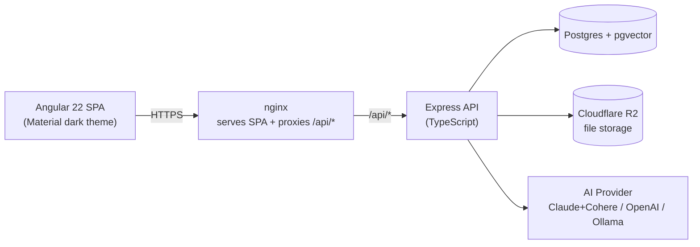

# Architecture

Zig's Personal Assistant is a self-hosted personal knowledge base: an Angular
SPA talks to an Express/TypeScript API, which stores notes and files in
Postgres (with pgvector for semantic search) and Cloudflare R2, and delegates
chat/embeddings to a pluggable AI provider.

## System overview



## Frontend (`frontend/`)

- **Angular 22**, standalone components, signals, `@angular/core/rxjs-interop`
  (`toSignal`), Angular Material (dark theme), `@angular/cdk/layout`
  (`BreakpointObserver`) for responsive layout.
- **Design tokens** (`src/styles.scss`) - brand overrides for Angular
  Material's M3 system variables (dark navy + cyan, `--mat-sys-*`) plus a set
  of app-wide `--app-*` tokens (`--app-bg`, `--app-surface`,
  `--app-surface-2`, `--app-border`, `--app-accent`, `--app-shadow-md`, text
  colors) used by non-Material elements across the app.
- **Layout shell** (`src/app/app.ts`, `layout/sidebar/`,
  `layout/bottom-nav/`) - `mat-sidenav-container` with a side-mode sidenav on
  desktop; on handsets (`max-width: 767.98px` via `BreakpointObserver`) the
  sidenav is hidden and a fixed `app-bottom-nav` tab bar (Home, Notes, Search,
  Chat, Files) is shown instead. `App` tracks the previous top-level route
  segment against a fixed `ROUTE_ORDER` to apply a forward/back/fade slide
  transition class (`nav-forward` / `nav-back`) to `<main>` on navigation.
- **Routing** (`src/app/app.routes.ts`) - lazy-loaded standalone feature
  components:

  | Path | Component |
  | --- | --- |
  | `/` | Home - dashboard (quick search, recent notes, file/chat counts, FAB) |
  | `/notes` | Notes List - card grid, tag/content-type filters |
  | `/notes/new`, `/notes/:id` | Note Editor - create/edit form |
  | `/search` | Hybrid search with highlighted snippets |
  | `/chat` | RAG chat with cited sources |
  | `/files` | Drag-and-drop file upload/list |

- **Core services** (`src/app/core/services/`) - `NotesApi`, `FilesApi`,
  `ChatApi`, calling same-origin `/api/*` endpoints, plus UI-utility services
  `HapticService` (short `navigator.vibrate` tap) and `ToastService`
  (Material snack-bar success/error toasts).
- **Shared mobile-UX utilities** (`src/app/shared/`) - `PullToRefresh`
  (touch-drag-to-refresh wrapper used by list views), `SkeletonList`
  (loading-state placeholder rows/chat bubbles), `LongPressDirective`
  (`appLongPress`, 500ms touch-hold), `NoteActionSheet` (Material bottom
  sheet with edit/delete/share, opened via long-press or overflow menu),
  `shareNote()` (Web Share API with clipboard-copy fallback + toast), and
  `HapticDirective` (fires `HapticService.tap()` on click/press for
  interactive elements).
- **Dev proxy** (`frontend/proxy.conf.json`) - `ng serve` proxies `/api/*` to
  `http://localhost:3000` so the frontend can be developed against a local
  backend without CORS issues.

## Backend (`backend/`)

Express + TypeScript, structured as:

- `src/index.ts` - app bootstrap: CORS, JSON body parsing, runs migrations on
  startup, mounts routes, error handler, listens on `config.port`.
- `src/routes/` - `notes.routes.ts`, `files.routes.ts`, `chat.routes.ts`
  (thin HTTP layer).
- `src/services/` - `notesService.ts`, `chatService.ts`, `r2Service.ts`
  (business logic + DB/R2/AI calls).
- `src/db/` - `pool.ts` (pg `Pool`), `migrate.ts` (runs `.sql` files from
  `migrations/`, tracked in a `schema_migrations` table), `migrations/001_init.sql`.
- `src/ai/` - pluggable AI provider abstraction (see below).
- `src/config.ts` - reads all environment variables with sane defaults.
- `src/middleware/errorHandler.ts` - centralized error responses.

### REST API

| Method | Path | Description |
| --- | --- | --- |
| `GET` | `/api/health` | Health check, returns configured AI provider |
| `GET` | `/api/notes` | List notes, optional `?tag=` and `?content_type=` filters |
| `POST` | `/api/notes` | Create a note (embeds title+content) |
| `GET` | `/api/notes/search?q=` | Hybrid full-text + semantic search |
| `GET` | `/api/notes/:id` | Get a note with its attached files |
| `PUT` | `/api/notes/:id` | Update a note (re-embeds if content changed) |
| `DELETE` | `/api/notes/:id` | Delete a note |
| `GET` | `/api/files` | List uploaded files |
| `POST` | `/api/files/upload` | Upload a file to R2 (multipart, optional `note_id`) |
| `GET` | `/api/files/:id/download` | Get a presigned download URL |
| `DELETE` | `/api/files/:id` | Delete a file |
| `POST` | `/api/chat` | Send a chat message; returns a reply with cited note sources |

## Database (Postgres + pgvector)

`backend/src/db/migrations/001_init.sql` creates:

- **`notes`**
  - `id UUID` primary key (`gen_random_uuid()`)
  - `title`, `content`, `content_type` (enum: `text`, `code`, `chat`, `file`, `link`), `source`, `tags TEXT[]`
  - `embedding vector(__EMBEDDING_DIM__)` - dimension is substituted by the
    migration runner based on `AI_PROVIDER` (1024 Cohere, 1536 OpenAI, 768
    Ollama/nomic-embed-text)
  - `search_vector tsvector` - generated column (`to_tsvector('english', title || content)`)
  - GIN index on `search_vector`, GIN index on `tags`, HNSW index on
    `embedding` (`vector_cosine_ops`)
  - `updated_at` auto-maintained via trigger
- **`files`**
  - `id UUID` primary key, `note_id` FK to `notes` (`ON DELETE CASCADE`),
    `r2_key`, `filename`, `mime_type`, `size_bytes`, `created_at`
  - index on `note_id`

Migrations run automatically on backend startup and are tracked in a
`schema_migrations` table (idempotent - already-applied files are skipped).

## Hybrid search

`notesService.searchNotes()` combines:

- **Full-text score**: `ts_rank_cd(search_vector, plainto_tsquery('english', q))`
- **Vector score**: `GREATEST(0, 1 - (embedding <=> query_embedding))` (cosine
  similarity via pgvector's `<=>` operator)
- **Combined score**: `text_score * 0.4 + vector_score * 0.6`, ordered
  descending
- Results include a `ts_headline` snippet with `<b>` highlight tags around
  matched terms (rendered via `[innerHTML]` in the Search view)

If embedding the query fails (e.g. AI provider unreachable), search falls back
to full-text-only.

## AI provider abstraction (`backend/src/ai/`)

A single `AIProvider` interface:

```ts
interface AIProvider {
  embed(text: string): Promise<number[]>;
  chat(messages: Message[], context: string[]): Promise<string>;
}
```

`AI_PROVIDER` selects both the **chat** and **embedding** provider via
`getChatProvider()` / `getEmbeddingProvider()`:

| `AI_PROVIDER` | Chat provider | Embedding provider |
| --- | --- | --- |
| `claude` | `ClaudeProvider` (`claude-sonnet-4-5`) | `CohereProvider` (`embed-english-v3.0`, 1024-dim) |
| `openai` | `OpenAIProvider` (`gpt-4o-mini`) | `OpenAIProvider` (`text-embedding-3-small`, 1536-dim) |
| `ollama` (default) | `OllamaProvider` (`qwen3:8b`) | `OllamaProvider` (`nomic-embed-text`, 768-dim) |

Switching `AI_PROVIDER` after notes already have embeddings does **not**
retroactively re-embed them (the vector column dimension is also fixed at
migration time per provider) - see [Plan / Next steps](plan.md).

## RAG chat flow (`chatService.chat()`)

1. Embed the latest user message.
2. Vector-search `notes` for the top 5 by cosine similarity, keeping only
   results with similarity > `0.2`.
3. Build a context array of `### {title}\n{content}` for each match.
4. Pass the full message history + context to `getChatProvider().chat()`.
5. Return `{ reply, sources: [{ id, title }] }` - the frontend renders
   `sources` as clickable chips that navigate to `/notes/:id`.

## File storage (Cloudflare R2)

`r2Service.ts` wraps the S3-compatible R2 API (`R2_ACCESS_KEY_ID`,
`R2_SECRET_ACCESS_KEY`, `R2_BUCKET_NAME`, `R2_ENDPOINT`). Uploaded files are
stored under a generated `r2_key`, recorded in the `files` table (optionally
linked to a `note_id`), and downloaded via presigned URLs.

In the Files view, `FilePreviewDialog` opens a presigned URL directly in an
``/`<iframe>` for images and PDFs; for other file types it shows the
linked note's content instead.

## Deployment topology

### Docker images (`docker/`)

- **`backend.Dockerfile`** - multi-stage `node:22-alpine`: build stage runs
  `npm ci && npm run build`; runtime stage installs prod deps only and runs
  `node dist/index.js`.
- **`frontend.Dockerfile`** - multi-stage: `node:22-alpine` builds the Angular
  app (`ng build --configuration production`), then `nginx:alpine` serves
  `dist/frontend/browser` and reverse-proxies `/api/*`.

### nginx reverse proxy (`docker/nginx.conf.template`)

- Templated with `${PORT}`, `${BACKEND_HOST}`, `${BACKEND_PORT}` via nginx's
  envsubst-on-templates entrypoint.
- `location /api/` uses
  `set $backend_upstream http://${BACKEND_HOST}:${BACKEND_PORT}; proxy_pass $backend_upstream;`
  with a `resolver ${NGINX_LOCAL_RESOLVERS} valid=10s;` directive, so the
  backend host is resolved **at request time** (via the container's
  `/etc/resolv.conf`, auto-detected by the image's `15-local-resolvers.envsh`
  script when `NGINX_ENTRYPOINT_LOCAL_RESOLVERS=1`) instead of once at
  startup. An unreachable backend returns `502` instead of crashing nginx.
- `location /` does SPA fallback (`try_files $uri $uri/ /index.html`).

### Local (Docker Compose)

`docker-compose.yml` runs four services: `postgres` (pgvector, port 5432),
`ollama` (local AI, port 11434), `backend` (port 3000, runs migrations on
startup), `frontend` (nginx, port 4200, proxies to `backend`). Service names
resolve via Docker's embedded DNS (`127.0.0.11`).

### Production (Railway)

Three services:

- **Postgres** - `pgvector/pgvector:pg16` with a volume.
- **PA-Backend** - built from `docker/backend.Dockerfile`. Requires
  `DATABASE_URL=${{Postgres.DATABASE_URL}}` (Railway variable reference -
  without it, `pg` defaults to `127.0.0.1:5432` and migrations crash-loop),
  plus `AI_PROVIDER`, the matching API key(s), `R2_*`, `CORS_ORIGIN`.
- **Personal-Assistant** (frontend) - built from `docker/frontend.Dockerfile`.
  Requires `BACKEND_HOST=pa-backend.railway.internal` and `BACKEND_PORT=3000`
  (Railway's bare service names aren't resolvable - they need the
  `.railway.internal` suffix).

See [Plan / Next steps](plan.md) for what's planned beyond this baseline.
